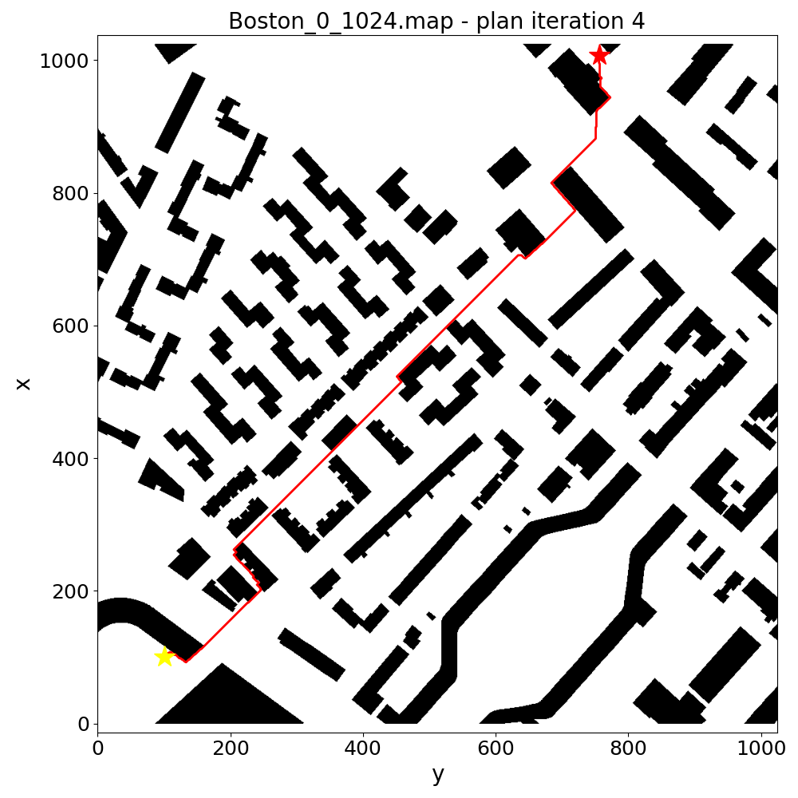
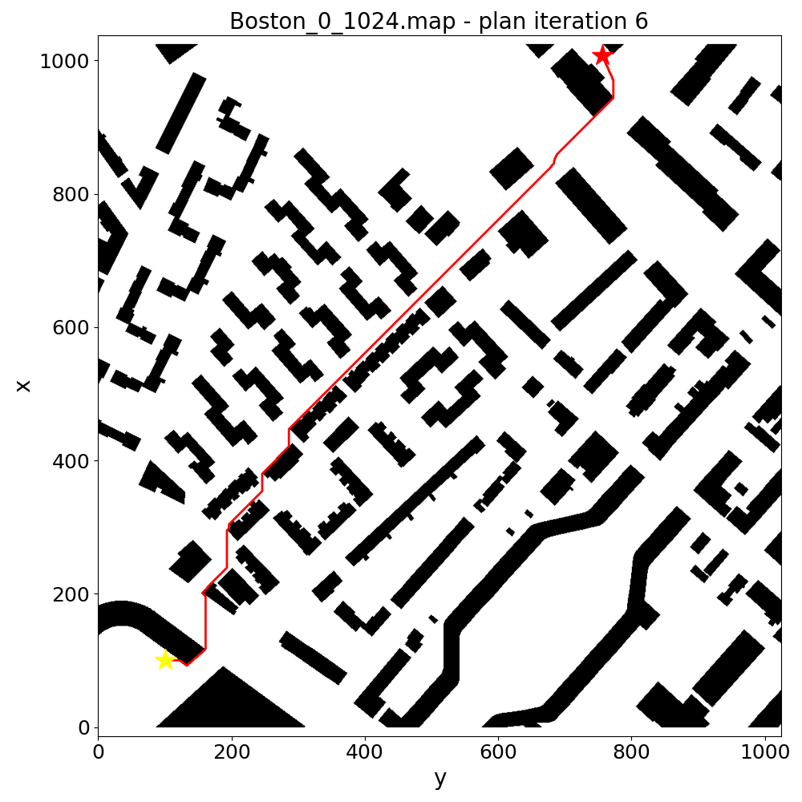
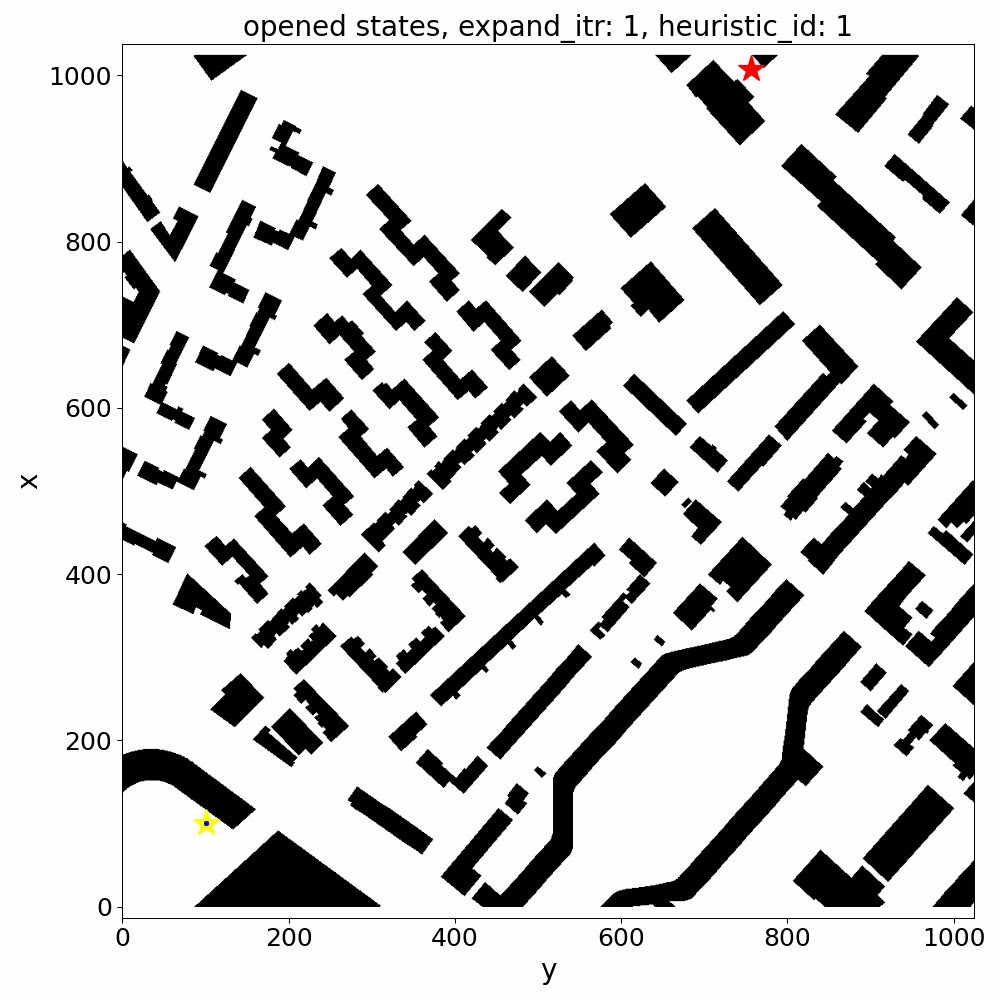

AMRA*
=====

AMRA* is a anytime multi-resolution multi-heuristic A* algorithm.

# Usage

## C++

Check [test_amra_star_2d.cpp](../test/gtest/test_amra_star_2d.cpp) for an example.

## Python

Working on it.

# Visualization Examples

You can use the [Python script](../python/erl_search_planning/amra_star/visualize.py) to visualize the search result
stored in `*.solution` file.

## 2D Grid Map

### Paths over Time

| Plan Iteration | 1                                                                                 | 2                                                                                 |
|----------------|-----------------------------------------------------------------------------------|-----------------------------------------------------------------------------------|
| Path           |  |  |
| Plan Iteration | 3                                                                                 | 4                                                                                 |
| Path           |  |  |
| Plan Iteration | 5                                                                                 | 6                                                                                 |
| Path           |  |  |

### Opened & Closed States

|              | Opened States                                                                                 | Closed States                                                                                     |
|--------------|-----------------------------------------------------------------------------------------------|---------------------------------------------------------------------------------------------------|
| Anchor Level |  |  |
| Resolution 1 |  |  |
| Resolution 2 |  |  |
| Resolution 3 |  |  |

### Inconsistent States

For more examples, please check [assets](assets) folder.

# References

- [AMRA* Paper](https://arxiv.org/pdf/2110.05328.pdf)
- [Original AMRA* Implementation](https://github.com/dhruvms/amra)
